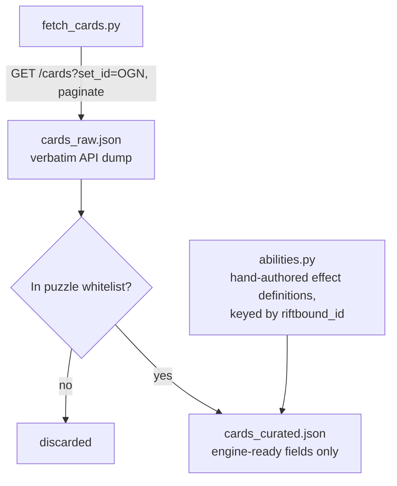

# Data Sources

No official Riot API access. Relying on community/fan-built open APIs, per `riftbound-lethal-puzzle-plan.md`. Both verified in this research pass (2026-09-11).

## Primary: Riftcodex

- Base URL: `https://api.riftcodex.com`
- No authentication required for reads (confirmed live).
- Fan project operating under Riot's "Legal Jibber Jabber" policy — same legal notice already in the repo README covers use of this data.
- Rate limits: not documented. Treat as unknown — cache aggressively, never call it at solve-time or puzzle-render-time, only during the one-time ingestion step.

### Endpoints used

| Endpoint | Purpose |
|---|---|
| `GET /cards?set_id=OGN&page=&size=` | Bulk pull of all Origins cards/printings, paginated (max size 100) |
| `GET /cards/{id}` | Single card by Riftcodex id, for spot-checks |
| `GET /cards/riftbound/{id}` | Lookup by Riftbound id (e.g. `ogn-209-298`), case-insensitive partial match |
| `GET /sets/set-id/OGN` | Set metadata (confirms card count, published date) |

Live-verified sample (`GET /cards?set_id=OGN&size=2`), `set_id=OGN` returns 352 printings (298 base cards + alternate arts, per `/sets` catalog and riftbound.gg).

### Card object shape (verified from live response)

```json
{
  "id": "69bc5bd2d308c64675ca879d",
  "name": "Cull the Weak",
  "riftbound_id": "ogn-209-298",
  "collector_number": 209,
  "attributes": { "energy": 2, "might": null, "power": 1 },
  "classification": { "type": "Spell", "supertype": null, "rarity": "Common", "domain": ["Order"] },
  "text": {
    "rich": "<p>Each player kills one of their units.</p>",
    "plain": "Each player kills one of their units.",
    "flavour": "..."
  },
  "set": { "set_id": "OGN", "label": "Origins" },
  "tags": [],
  "metadata": { "clean_name": "Cull the Weak", "alternate_art": false, "overnumbered": false, "signature": false }
}
```

**Important limitation:** `text.plain` / `text.rich` is unstructured prose, not machine-readable effect data. Keyword mentions appear inline as bracketed tags (e.g. `[Legion]`) and template placeholders (e.g. `:rb_might:` for a rune-token icon) but there is no structured `keywords[]` or `effect` field. **The API cannot be used to auto-derive rules logic.** Every card the engine needs to actually resolve must be hand-transcribed into a structured ability definition — this is why v0 scope is a whitelist, not "all of Origins" (see [`07-scope-and-cut-list.md`](07-scope-and-cut-list.md)).

`attributes.energy` / `attributes.power` / `attributes.might` and `classification.domain[]` *are* structured and directly usable for cost/legality checks.

## Secondary: RiftScribe

- Advertised: free public API, no auth, plus an MCP service for AI agents, at `riftscribe.gg`.
- The specific docs path checked in this session (`riftscribe.gg/api-docs`) returned 404 — the site may have moved its docs, or the page name is different.
- **Not wired into v0.** Treat as a fallback only if Riftcodex is missing a card or goes down. Before relying on it, someone needs to re-locate its actual docs and verify schema, same as was just done for Riftcodex.

## Ingestion pipeline



Source: [`diagrams/01-pipeline.mmd`](diagrams/01-pipeline.mmd)

**As built** (the names differ slightly from the sketch above; the shape does not):

- `solver/fetch_cards.py` — one-time/on-demand script, hits Riftcodex, writes `data/cards-ogn.json`. Never called from solver or export code paths. Four paginated requests for the whole set.
- `data/cards-ogn.json` — verbatim API dump keyed by `riftbound_id`, small enough to commit (298 base cards) and **committed on purpose**: a fresh clone, a CI run and an offline build all need names without network, and Riftcodex is a fan project with no uptime guarantee. It was down — timeouts and 502s on every path including `/` — when the ingestion was written, which is exactly why nothing may depend on reaching it.
- The curation step below stayed hand-written rather than generated: `solver/engine/card_pool.py` is the whitelist, transcribed by hand, and there is no `cards_curated.json`. The dump feeds **display only**, through `solver/engine/card_names.py` (action labels) and `web/scripts/fetch-card-names.mjs` (a trimmed derivative for the browser).
- Both readers fall back to the raw `card_id`, so an absent or stale cache degrades presentation and nothing else. The engine and its tests behave identically without the file. See [`data/README.md`](../data/README.md).
- Curation step filters to the whitelist and attaches a hand-written `ability_id` pointing into a structured effects registry (module of Python callables/data, not parsed from `text.plain`).
- Any card not on the whitelist is simply absent from `cards_curated.json` — the engine never sees it, so it can't be played into a puzzle by accident.
