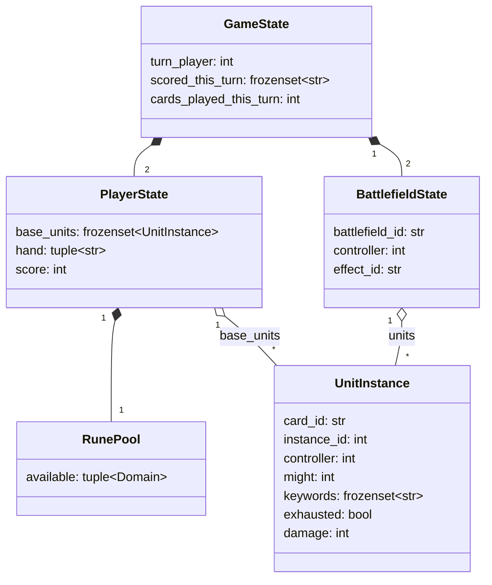

# State Model

Confirmed against the official Core Rules PDF (2026-09-11 research pass, rule citations inline): **2 battlefields per game** (not configurable in v0 — matches `riftbound-lethal-puzzle-plan.md`).

**Puzzles are single-turn** (per the existing 6-week plan: "a fixed starting position with a fixed energy budget"). This removes a whole category of multi-turn bookkeeping from the model:
- No Channel Phase in-search — the starting rune pool is fixed as part of puzzle authoring, not generated mid-solve. `ChannelRune` is not an action (see `03-action-space.md`).
- No Awaken/rune-recovery logic — there's no next turn inside the puzzle horizon, so whether a spent rune would theoretically recover later is irrelevant. `RunePool` only needs to track what's still available *this* turn.
- Hold points are pre-resolved into the starting position (Hold triggers at the Beginning Phase, before the puzzle's live turn begins) — not something the solver enacts as an action. Only Conquer and card-effect scoring happen as live search outcomes.

## Types

```python
Domain = Literal["Fury", "Calm", "Mind", "Body", "Chaos", "Order"]  # confirmed: rule 164 lists exactly these 6 Basic Rune domains

@dataclass(frozen=True)
class UnitInstance:
    card_id: str              # riftbound_id, e.g. "ogn-218-298"
    instance_id: int          # disambiguates duplicate copies / tokens on board
    controller: int           # 0 or 1
    might: int                # current effective might (base + active modifiers)
    keywords: frozenset[str]  # resolved keyword set, including granted keywords
    exhausted: bool            # newly-played units enter exhausted (rule 143.4.a) — a unit played this
                                # turn generally can't MoveUnit the same turn unless a keyword like
                                # Accelerate grants ready-on-play
    damage: int                # marked damage this turn — single-turn puzzle horizon means we never need
                                # cross-turn cleanup timing for this field, only within-turn accumulation
    is_token: bool

@dataclass(frozen=True)
class RunePool:
    # single-turn puzzle: no next-turn recovery to model, so this is just "what's left to spend."
    # rule 164.2.b: a rune produces EITHER Energy (Exhaust) OR Power of its own domain (Recycle) —
    # never both from the same rune. Paying a combined Energy+Power cost draws from separate runes.
    available: tuple[Domain, ...]   # one entry per untapped rune still on the board this turn
    # spending a rune for Energy or Power both just remove it from `available` for the rest of
    # this puzzle's single turn — the distinction only matters for which runes can satisfy a
    # Power cost (domain-matched) vs an Energy cost (any domain).
    #
    # a card effect that generates a rune mid-turn (e.g. "when you play me, add a rune") just
    # appends to `available` on the child state like any other field mutation — no separate
    # mechanic needed. legal_actions() is always recomputed fresh from state (03), so a
    # newly-granted rune is immediately visible to every action-legality check later in that
    # DFS branch. Flag whether the granted rune enters ready or exhausted (rule 430.4.b shows
    # both are possible depending on the card's wording) when it's added to the whitelist.

@dataclass(frozen=True)
class BattlefieldState:
    battlefield_id: str                    # fixed identity, e.g. "left" / "right" — order matters, not sortable
    controller: int | None                 # None if uncontested/empty
    units: frozenset[UnitInstance]         # units currently present, both controllers possible mid-combat
    effect_id: str | None                  # v0 puzzles use None only (see scope doc)

@dataclass(frozen=True)
class PlayerState:
    base_units: frozenset[UnitInstance]    # units not on a battlefield. Confirmed (rule 355.7/355.8):
                                             # units CAN be played directly to a battlefield the controller
                                             # already controls, not just to Base — so base_units is not the
                                             # only entry point, PlayUnit can target either zone (03).
    hand: tuple[str, ...]                  # card_ids; order doesn't matter for hashing but keep tuple for display
    runes: RunePool
    score: int

@dataclass(frozen=True)
class GameState:
    turn_player: int                        # 0 or 1 — always 0 in v0, single-turn puzzles have no turn hand-off
    players: tuple[PlayerState, PlayerState]
    battlefields: tuple[BattlefieldState, BattlefieldState]
    scored_this_turn: frozenset[str]        # battlefield_ids the turn_player has SCORED this turn — via
                                             # Conquer OR Hold (rule 471.1.b: "a player may only Score, from
                                             # either method, once per battlefield per turn"). Hold-scored
                                             # battlefields are seeded into this set as part of the starting
                                             # position (Hold is pre-resolved, not a live search action — see
                                             # note above); Conquer adds to it during search.
    cards_played_this_turn: int             # needed for Legion-style "if you've played another card this turn" keywords (seen live in Vanguard Captain)
```

`scored_this_turn` is the field a naive model forgets and the one the last-point rule depends on entirely. **Correction from the initial design pass:** it tracks *Scored* (Conquer or Hold), not Conquer alone — confirmed against rule 472-476, which checks "has the player Scored every Battlefield this turn," and rule 471.1.b's definition of Scoring as either method. Two independent blog sources both said "conquered every battlefield," which is stricter than the actual rule — see `04-scoring-rules.md`.

## Canonical hash

Needed so IDDFS's transposition table collapses equivalent states reached via different action orderings.

```python
def canonical_key(state: GameState) -> tuple:
    # 1. units within base_units and within each battlefield's units are order-independent
    #    AND instance_id is EXCLUDED from the per-unit key -> sort by
    #    (card_id, controller, might, keywords, exhausted, damage, is_token), duplicates preserved.
    #    This makes it a multiset comparison: two identical-looking tokens (e.g. two 1-might
    #    Recruit tokens) collapse to the same key regardless of which instance_id counter values
    #    they happen to carry, so two action orderings that create "the same" tokens in a
    #    different creation order (and thus different instance_id numbers) still dedup correctly.
    # 2. battlefields are NOT sortable relative to each other — battlefield identity/effect
    #    can differ (e.g. a named battlefield raising win threshold), so battlefield_id order is fixed
    # 3. hand order doesn't matter -> sort card_ids
    # 4. RunePool.available is a multiset (which physical rune is which doesn't matter, only
    #    domain counts) -> sort the tuple before hashing
    # 5. everything else hashes as-is
    ...
```

**Correction from the initial design pass:** the original version of this section said `instance_id` should stay *in* the per-unit key "so identical units still collapse correctly" — that's backwards. Keeping `instance_id` in the comparison makes two structurally-identical units compare *unequal* whenever they happen to carry different instance numbers (exactly the case that arises when the same set of tokens gets created in a different order across two action sequences), which *defeats* transposition-table dedup for any puzzle involving tokens. `instance_id` still exists on `UnitInstance` and is used elsewhere (actions reference a specific instance to move/target it) — it's simply excluded from the dedup key, which is a separate concern from action targeting.

Implemented as `canonical_key(state) -> tuple` rather than a byte digest — a plain tuple is already hashable and directly usable as a dict key (the transposition table's actual use, see `05-dfs-solver.md`), so there's no serialization/hashing step to write or to introduce collision risk in.

## Diagram



Source: [`diagrams/02-state-model.mmd`](diagrams/02-state-model.mmd)
