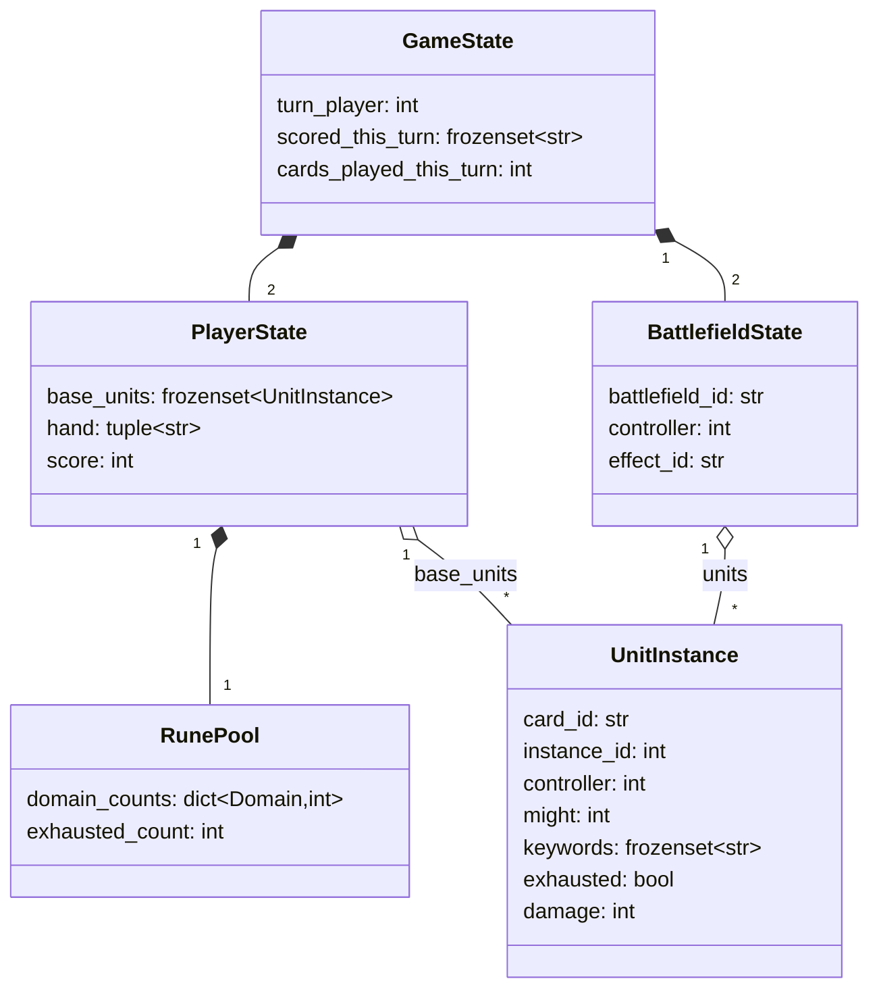

# State Model

Confirmed against rules research (2026-09-11): **2 battlefields per game** (not configurable in v0 — matches `riftbound-lethal-puzzle-plan.md`). Sources: riftbound.gg scoring guide, danireon.com rules summary.

Two open items below (rune payment, base-vs-battlefield deployment) are flagged **unverified** — confirm against the official Core Rules PDF before Week 1 code freezes this model. See [`07-scope-and-cut-list.md`](07-scope-and-cut-list.md#open-questions).

## Types

```python
Domain = Literal["Fury", "Calm", "Mind", "Body", "Chaos", "Order"]  # confirm exact 6 vs actual card data

@dataclass(frozen=True)
class UnitInstance:
    card_id: str              # riftbound_id, e.g. "ogn-218-298"
    instance_id: int          # disambiguates duplicate copies / tokens on board
    controller: int           # 0 or 1
    might: int                # current effective might (base + active modifiers)
    keywords: frozenset[str]  # resolved keyword set, including granted keywords
    exhausted: bool
    damage: int                # marked damage, cleared per rules (verify: end of turn? not at all in v0 tapped-out model?)
    is_token: bool

@dataclass(frozen=True)
class RunePool:
    domain_counts: Mapping[Domain, int]   # available (untapped) runes by domain
    exhausted_count: int                   # runes exhausted this turn (for Energy), recoverable next Awaken
    # recycled runes are simply removed from the pool entirely (Power cost = permanent loss)
    # a card effect that generates a rune mid-turn (e.g. "when you play me, add a rune") just
    # produces a child GameState with an updated RunePool like any other effect — no separate
    # mechanic needed. legal_actions() is always recomputed fresh from state (03), so a
    # newly-granted rune is immediately visible to every action-legality check later in that
    # DFS branch. Flag whether the granted rune enters untapped or already-exhausted, and its
    # domain, per the specific card's text when it's added to the whitelist.

@dataclass(frozen=True)
class BattlefieldState:
    battlefield_id: str                    # fixed identity, e.g. "left" / "right" — order matters, not sortable
    controller: int | None                 # None if uncontested/empty
    units: frozenset[UnitInstance]         # units currently present, both controllers possible mid-combat
    effect_id: str | None                  # v0 puzzles use None only (see scope doc)

@dataclass(frozen=True)
class PlayerState:
    base_units: frozenset[UnitInstance]    # units not on a battlefield (verify: is this the correct default zone — see open questions)
    hand: tuple[str, ...]                  # card_ids; order doesn't matter for hashing but keep tuple for display
    runes: RunePool
    score: int

@dataclass(frozen=True)
class GameState:
    turn_player: int                        # 0 or 1
    players: tuple[PlayerState, PlayerState]
    battlefields: tuple[BattlefieldState, BattlefieldState]
    scored_this_turn: frozenset[str]        # battlefield_ids the turn_player has *conquered* this turn — resets at start of each of their turns
    cards_played_this_turn: int             # needed for Legion-style "if you've played another card this turn" keywords (seen live in Vanguard Captain)
```

`scored_this_turn` is the field a naive model forgets and the one the last-point rule depends on entirely — carried over verbatim from the existing 6-week plan's design note.

## Canonical hash

Needed so IDDFS's transposition table collapses equivalent states reached via different action orderings.

```python
def canonical_hash(state: GameState) -> bytes:
    # 1. units within base_units and within each battlefield's units are order-independent
    #    -> sort by (card_id, instance_id) before hashing, so set order never matters
    # 2. battlefields are NOT sortable relative to each other — battlefield identity/effect
    #    can differ (e.g. a named battlefield raising win threshold), so battlefield_id order is fixed
    # 3. hand order doesn't matter -> sort card_ids
    # 4. everything else hashes as-is
    ...
```

`instance_id` stays in the sort key (not stripped) so two board states with the *same* card at the *same* might/keywords/exhaustion but different underlying instances still collapse correctly — dedup is about board equivalence, not instance identity.

## Diagram



Source: [`diagrams/02-state-model.mmd`](diagrams/02-state-model.mmd)
