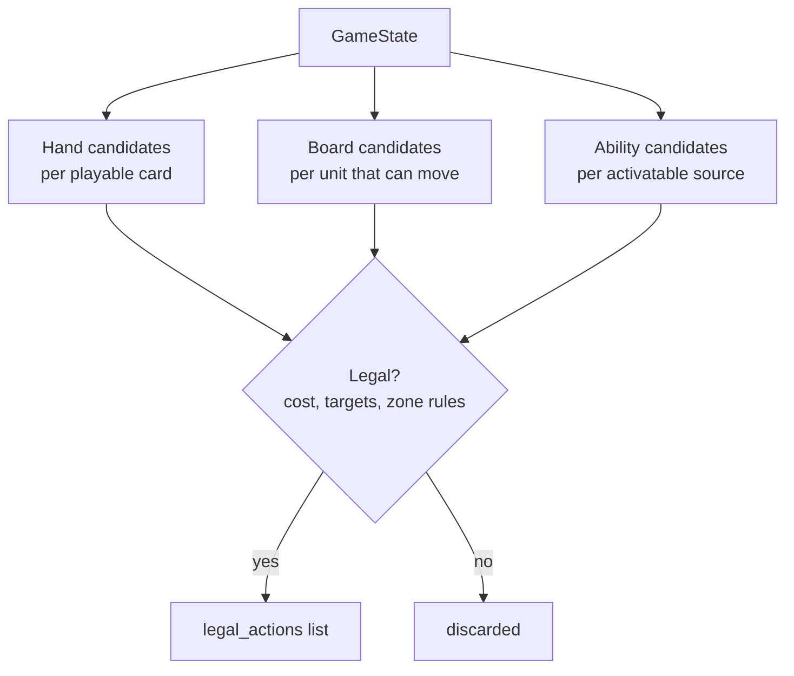

# Action Space

v0 action types — deliberately not full rules coverage, see [`07-scope-and-cut-list.md`](07-scope-and-cut-list.md).

| Action | Effect | Legality checks |
|---|---|---|
| `PlayUnit(card_id, target_zone)` | Move card from hand to base (or battlefield — pending open question) as a new `UnitInstance` | Energy/Power affordable from `RunePool`; card is a Unit type; target zone rules per open question |
| `MoveUnit(instance_id, from_zone, to_zone)` | Unit travels to a battlefield; if opposing units present, triggers combat (auto-resolved under tapped-out assumption) | Unit not exhausted; destination reachable per movement rules (verify: any battlefield, or adjacency rules?) |
| `PlaySpell(card_id, targets)` | Resolve spell's hand-authored effect | Energy/Power affordable; valid targets exist per the effect's own rules |
| `PlayGear(card_id, target_unit)` | Attach gear, modifying `UnitInstance` fields (might/keywords) | Energy/Power affordable; target legal per gear text |
| `ChannelRune(domain)` *(pending open question — may be automatic, not a chosen action)* | Adds runes to `RunePool` | Once per turn; domain choice legality TBD |
| `ActivateAbility(source_id, ability_id)` | Only for whitelisted legend/unit activated abilities a chosen puzzle needs | Cost affordable; source not exhausted if ability requires it |

All actions increment `cards_played_this_turn` when a card is played from hand (needed for Legion-style "if you've played another card this turn" checks — confirmed live on Vanguard Captain in the Riftcodex sample pull).

## Generation pipeline

Source: [`diagrams/03-action-generation.mmd`](diagrams/03-action-generation.mmd)

Each candidate generator is independent and testable on its own (one generator per zone type), then merged and filtered by a single `is_legal(state, action) -> bool` gate — keeps the combinatorial legality logic in one place instead of scattered across generators, which matters once pruning (05) needs to call the same legality check.

## Combat resolution (tapped-out assumption)

Per `riftbound-lethal-puzzle-plan.md`: the tapped-out assumption removes *defender choice* (no showdown reactions), not combat itself. `MoveUnit` onto a contested battlefield still:
1. Resolves combat deterministically (defender deals damage, defender's triggered abilities fire — these aren't "choices", they're fixed resolution)
2. Only branches the search when the *attacker* has a genuine choice (e.g. damage assignment across multiple defenders) — see pruning notes in [`05-dfs-solver.md`](05-dfs-solver.md#damage-assignment-branching)
