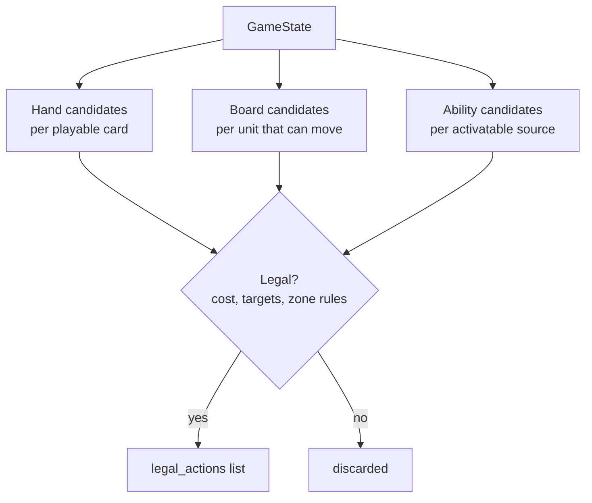

# Action Space

v0 action types — deliberately not full rules coverage, see [`07-scope-and-cut-list.md`](07-scope-and-cut-list.md).

| Action | Effect | Legality checks |
|---|---|---|
| `PlayUnit(card_id, target_zone, rune_payment)` | Move card from hand to Base **or** to a battlefield the controller already controls (rule 355.7/355.8 — both are valid targets, confirmed) **or** an open battlefield if the card grants that exception (`CardDef.can_play_to_open_battlefield`, e.g. Sneaky Deckhand) as a new `UnitInstance`, entering exhausted (rule 143.4.a). Establishes control (a Conquer-eligible event) when the target was open. | Chosen `rune_payment` (which specific runes get spent) covers Energy (any domain) + Power (domain-matched) cost from `RunePool.available`; card is a Unit type |
| `MoveUnit(instance_id, from_zone, to_zone)` | Unit travels to Base or a Battlefield, **and becomes exhausted as part of the move's cost** (rule 145.1: "The Costs of Exhausting the Units are also paid Simultaneously" — confirmed, exhausting is inherent to a Standard Move, not just a side effect of attacking). If opposing units present at the destination, triggers combat (auto-resolved under tapped-out assumption) | Unit not exhausted (so a unit played this turn generally can't move the same turn, absent a keyword like Accelerate, and a unit that already moved this turn can't move again without something re-readying it — e.g. Ride The Wind); destination reachable per movement rules (rule 145.2.a: Base→Battlefield and Battlefield→Base always legal; Battlefield→Battlefield only with Ganking, rule 810) |
| `PlaySpell(card_id, params, rune_payment)` | Generic cost/hand bookkeeping is engine code (`apply_play_spell_cost`); the actual game effect is looked up in `abilities.py`'s per-card registry, added one spell at a time as puzzles need them — see "Spell effect registry" below | Rune payment covers cost as above; `params`' meaning and legality is entirely up to the registered spell's own `is_legal` function |
| `PlayGear(card_id, target_unit, rune_payment)` | Attach gear, modifying `UnitInstance` fields (might/keywords) | Rune payment covers cost as above; target legal per gear text |
| `ActivateAbility(source_id, ability_id, rune_payment?)` | Only for whitelisted legend/unit activated abilities a chosen puzzle needs | Cost affordable; source not exhausted if ability requires it |

**No `ChannelRune` action.** Confirmed (rule 315.4/431): channeling is a mandatory automatic step of the Beginning Phase — 2 runes off the top of the Rune Deck, no domain choice — not a player-chosen action. It also doesn't apply here at all: puzzles are single-turn with a fixed starting rune pool (per `02-state-model.md`), so channeling never fires mid-solve regardless.

**`rune_payment` is itself a choice**, not a detail hidden inside the affordability check. Rule 164.2.b: one rune yields Energy (Exhaust) *or* Power of its own domain (Recycle) — never both — so paying a combined cost means picking which specific runes cover the Power portion (domain-matched) vs. the Energy portion (any domain). When there's more than one legal way to split payment across available runes, that's a genuine branch point for the action generator, not solver-internal bookkeeping.

All actions increment `cards_played_this_turn` when a card is played from hand (needed for Legion-style "if you've played another card this turn" checks — confirmed live on Vanguard Captain in the Riftcodex sample pull).

## Generation pipeline

Source: [`diagrams/03-action-generation.mmd`](diagrams/03-action-generation.mmd)

Each candidate generator is independent and testable on its own (one generator per zone type), then merged and filtered by a single `is_legal(state, action) -> bool` gate — keeps the combinatorial legality logic in one place instead of scattered across generators, which matters once pruning (05) needs to call the same legality check.

**Rune-payment dedup:** when generating `rune_payment` splits for a playable card, collapse payment choices that are equivalent under the canonical hash (02) — e.g. if a player has three untapped Order runes and only needs to Recycle one for Power, which specific one of the three is irrelevant, so generate one representative payment per distinct *domain-count* split, not one per physical-rune permutation. Otherwise this is a needless branching-factor multiplier with zero effect on reachable states.

## Spell effect registry

`abilities.py` holds `SPELL_EFFECTS: dict[card_id -> (is_legal, effect, generate_candidates)]`. Each registered spell owns its own target/params legality and game effect entirely — the engine doesn't try to interpret card text generically. First (and so far only) entry: Ride The Wind ("Move a friendly unit and ready it"), which reuses `relocate_unit`/`is_legal_destination` from `actions.py` with `exhausted_after=False` instead of the Standard Move's `True`, demonstrating the "hidden extra action" trick for puzzle concept 4.

This lives in `abilities.py` rather than `actions.py` because `legal_actions()`'s spell-candidate generation needs to import both `actions.py` (for the shared move/destination helpers) and the registry itself — putting the registry in `actions.py` would make it import back from wherever calls it, a circular import. So `legal_actions()` itself lives in `search.py`, composing `actions.legal_board_actions` (PlayUnit/MoveUnit only) with `abilities.SPELL_EFFECTS`-driven `PlaySpell` candidates. `actions.py` keeps a narrower `legal_board_actions` for exactly this reason.

**Resolved:** Ganking's Battlefield→Battlefield restriction (rule 810) is specific to a unit's own Standard Move — spell-granted "Move" effects (Ride The Wind, Charm) default to moving a unit to any zone with no Ganking requirement, unless the specific card text narrows it (e.g. "to its base"). Implemented as a separate `is_legal_ability_move_destination` helper in `actions.py`, distinct from `is_legal_destination` (Standard Move only). See `07-scope-and-cut-list.md`'s resolved item #6.

## Combat resolution (tapped-out assumption)

Per `riftbound-lethal-puzzle-plan.md`: the tapped-out assumption removes *defender choice* (no showdown reactions), not combat itself. `MoveUnit` onto a contested battlefield still:
1. Resolves combat deterministically (defender deals damage, defender's triggered abilities fire — these aren't "choices", they're fixed resolution)
2. Only branches the search when the *attacker* has a genuine choice (e.g. damage assignment across multiple defenders) — see pruning notes in [`05-dfs-solver.md`](05-dfs-solver.md#damage-assignment-branching)

**Not yet designed, flagged for when this section actually gets built:** the order "when I attack" and "when I defend" triggered abilities fire relative to each other and to damage assignment. Needs to be nailed down explicitly against the rules, not assumed, before combat resolution is implemented — see `07-scope-and-cut-list.md`'s open item #7.
