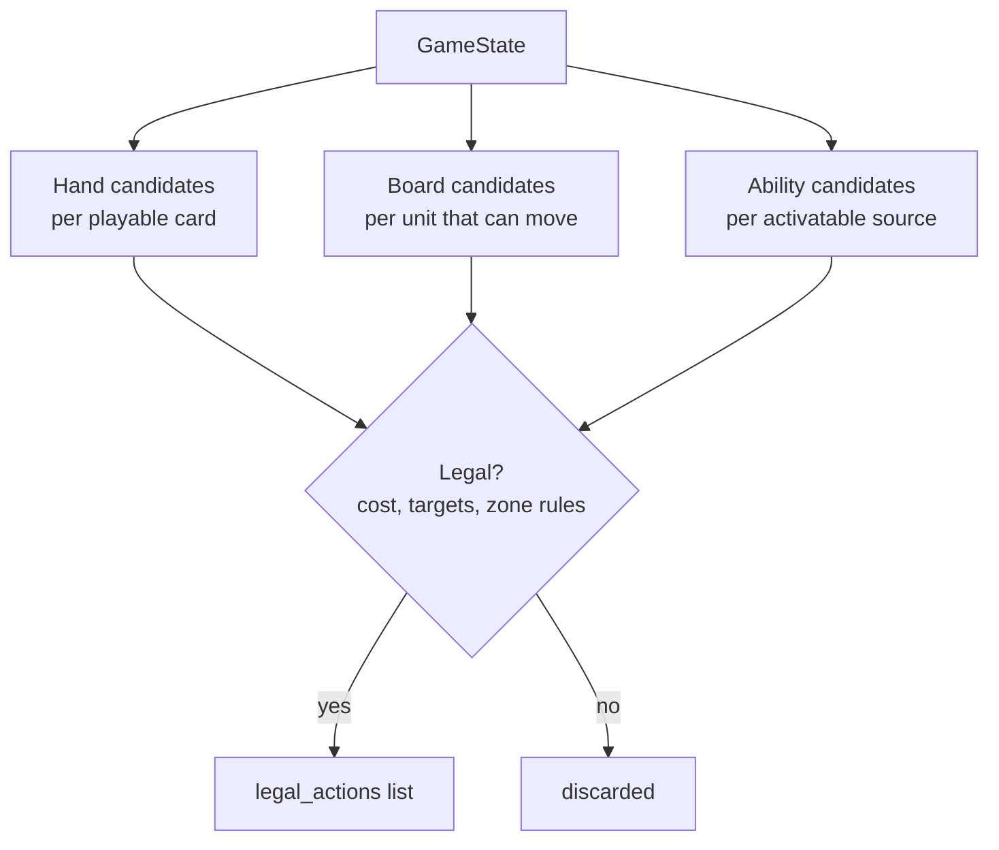

# Action Space

v0 action types — deliberately not full rules coverage, see [`07-scope-and-cut-list.md`](07-scope-and-cut-list.md).

| Action | Effect | Legality checks |
|---|---|---|
| `PlayUnit(card_id, target_zone, rune_payment)` | Move card from hand to Base **or** to a battlefield the controller already controls (rule 355.7/355.8 — both are valid targets, confirmed) as a new `UnitInstance`, entering exhausted (rule 143.4.a) | Chosen `rune_payment` (which specific runes get spent) covers Energy (any domain) + Power (domain-matched) cost from `RunePool.available`; card is a Unit type |
| `MoveUnit(instance_id, from_zone, to_zone)` | Unit travels to a battlefield; if opposing units present, triggers combat (auto-resolved under tapped-out assumption) | Unit not exhausted (so a unit played this turn generally can't move the same turn, absent a keyword like Accelerate); destination reachable per movement rules |
| `PlaySpell(card_id, targets, rune_payment)` | Resolve spell's hand-authored effect | Rune payment covers cost as above; valid targets exist per the effect's own rules |
| `PlayGear(card_id, target_unit, rune_payment)` | Attach gear, modifying `UnitInstance` fields (might/keywords) | Rune payment covers cost as above; target legal per gear text |
| `ActivateAbility(source_id, ability_id, rune_payment?)` | Only for whitelisted legend/unit activated abilities a chosen puzzle needs | Cost affordable; source not exhausted if ability requires it |

**No `ChannelRune` action.** Confirmed (rule 315.4/431): channeling is a mandatory automatic step of the Beginning Phase — 2 runes off the top of the Rune Deck, no domain choice — not a player-chosen action. It also doesn't apply here at all: puzzles are single-turn with a fixed starting rune pool (per `02-state-model.md`), so channeling never fires mid-solve regardless.

**`rune_payment` is itself a choice**, not a detail hidden inside the affordability check. Rule 164.2.b: one rune yields Energy (Exhaust) *or* Power of its own domain (Recycle) — never both — so paying a combined cost means picking which specific runes cover the Power portion (domain-matched) vs. the Energy portion (any domain). When there's more than one legal way to split payment across available runes, that's a genuine branch point for the action generator, not solver-internal bookkeeping.

All actions increment `cards_played_this_turn` when a card is played from hand (needed for Legion-style "if you've played another card this turn" checks — confirmed live on Vanguard Captain in the Riftcodex sample pull).

## Generation pipeline

Source: [`diagrams/03-action-generation.mmd`](diagrams/03-action-generation.mmd)

Each candidate generator is independent and testable on its own (one generator per zone type), then merged and filtered by a single `is_legal(state, action) -> bool` gate — keeps the combinatorial legality logic in one place instead of scattered across generators, which matters once pruning (05) needs to call the same legality check.

**Rune-payment dedup:** when generating `rune_payment` splits for a playable card, collapse payment choices that are equivalent under the canonical hash (02) — e.g. if a player has three untapped Order runes and only needs to Recycle one for Power, which specific one of the three is irrelevant, so generate one representative payment per distinct *domain-count* split, not one per physical-rune permutation. Otherwise this is a needless branching-factor multiplier with zero effect on reachable states.

## Combat resolution (tapped-out assumption)

Per `riftbound-lethal-puzzle-plan.md`: the tapped-out assumption removes *defender choice* (no showdown reactions), not combat itself. `MoveUnit` onto a contested battlefield still:
1. Resolves combat deterministically (defender deals damage, defender's triggered abilities fire — these aren't "choices", they're fixed resolution)
2. Only branches the search when the *attacker* has a genuine choice (e.g. damage assignment across multiple defenders) — see pruning notes in [`05-dfs-solver.md`](05-dfs-solver.md#damage-assignment-branching)
