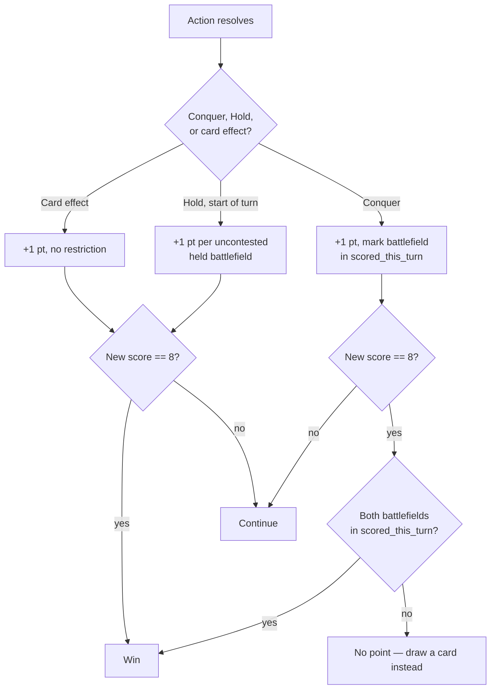

# Scoring Rules

This module gates everything downstream. Per the existing 6-week plan's kill criteria: if this isn't passing tests by end of Week 2, the project pivots. Write it with unit tests before any search code exists.

## Confirmed rules (2026-09-11 research pass)

Sources: [riftbound.gg scoring guide](https://riftbound.gg/the-in-depth-guide-to-scoring-in-riftbound/), [danireon.com win-conditions summary](https://www.danireon.com/en-us/blogs/news/how-to-win-riftbound-scoring-system-win-conditions), cross-checked and agreeing.

- **2 battlefields per game.** Win at 8 points (1v1).
- **Conquer:** move a unit onto a battlefield you don't control, take control → +1 point immediately. Mark that battlefield in `scored_this_turn` for the turn player.
- **Hold:** at the start of your turn, for each battlefield you control uncontested → +1 point per battlefield held.
- **Card-effect points:** some effects grant points directly, bypassing the battlefield system entirely.
- **Last-point restriction (the trap mechanic this whole project is built around):** if a Conquer would take you from 7 to 8, it only counts if **you have conquered both battlefields this turn**. Otherwise: no point, draw a card instead. Confirmed near-verbatim on both sources: *"8th Point by Conquer → you must have scored both Battlefields that turn to win."*
- **This restriction applies only to the Conquer path.** Hold and card-effect points at 8 win instantly, no additional condition. Both sources agree on this.

## Unverified — confirm against official Core Rules PDF before locking the test suite

Official PDF (couldn't fetch full text this session — 10MB+, blocked tools): `https://cmsassets.rgpub.io/sanity/files/dsfx7636/news_live/e9ac8e3d33e0f78cef296f5945aba7bc1313b086.pdf` (via playriftbound.com/en-us/rules-hub/, last updated 2026-07-16).

1. Is `scored_this_turn` reset exactly at the start of the turn player's own turn, or at some other point (e.g. cleanup of the *previous* turn)?
2. Damage/state cleanup timing (does marked damage on units clear each turn, and when?) — affects whether `UnitInstance.damage` needs to persist across the turn boundary in the state model.
3. Whether "battlefield you don't control" for Conquer means literally empty/opponent-controlled, or has an uncontested/contested distinction independent of `controller`.

Do not write the test suite against blog paraphrases for these three — get the primary source first.

## Decision flow

Source: [`diagrams/04-scoring-flow.mmd`](diagrams/04-scoring-flow.mmd)

## Test suite plan (Week 1 gate, per existing 6-week plan)

Source the actual test cases from RiftJudge rulings and the official rules once question set above is resolved — not fabricated here. Categories to cover once sourced:
- Conquer to exactly 8 with both battlefields conquered this turn → win
- Conquer to exactly 8 with only one battlefield conquered this turn → draw-a-card, no win, score stays at 7
- Hold to exactly 8 → win, no battlefield-count restriction
- Card effect to exactly 8 → win, no restriction
- `scored_this_turn` correctly resets between turns (regression test for the field most likely to be implemented wrong)
