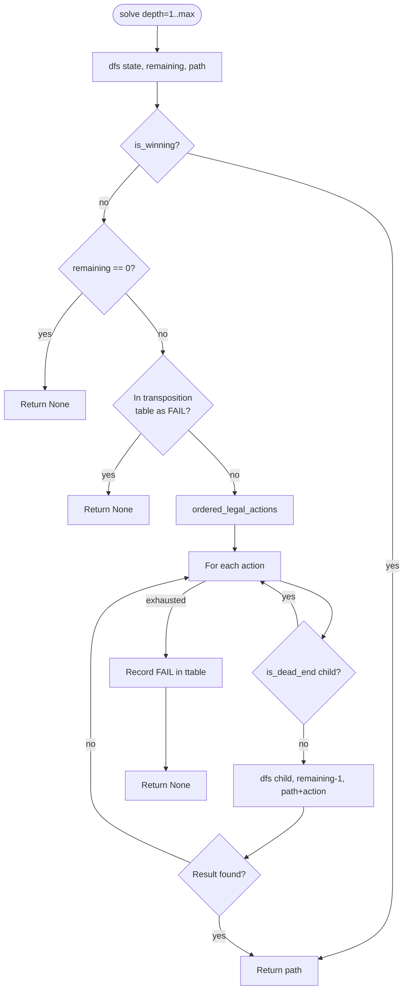

# DFS Solver

Iterative-deepening DFS (IDDFS), not plain DFS and not BFS. Rationale carried from the 6-week plan: at branching ~8-15 and depth up to 12, BFS's frontier gets too large; IDDFS uses depth-proportional memory and finds the shortest winning line first, which is exactly "wins in fewest actions."

## Algorithm

```python
def solve(root: GameState, max_depth: int) -> Solution | None:
    transposition_table: dict[tuple[bytes, int], Literal["FAIL"]] = {}
    for depth_limit in range(1, max_depth + 1):
        result = dfs(root, depth_limit, path=[], ttable=transposition_table)
        if result is not None:
            return result
    return None  # no solution within max_depth

def dfs(state: GameState, remaining: int, path: list[Action], ttable) -> list[Action] | None:
    if is_winning(state):          # scoring module (04) — checks the just-applied action's result
        return path

    if remaining == 0:
        return None

    key = (canonical_hash(state), remaining)
    if ttable.get(key) == "FAIL":
        return None                # proven no win from here within this depth budget before

    for action in ordered_legal_actions(state):   # heuristic ordering, see below
        child = apply(state, action)
        if is_dead_end(child):     # pruning, see below
            continue
        result = dfs(child, remaining - 1, path + [action], ttable)
        if result is not None:
            return result

    ttable[key] = "FAIL"
    return None
```

`is_winning` is checked on **entry** to a state (i.e. after the parent applied an action), not as a separate action type — a state either already reflects a game-winning point or it doesn't, per the scoring module.

## Transposition table

- Keyed on `(canonical_hash(state), remaining_depth)`, not just the hash — a state proven a dead end with 3 moves left may still win with 5 moves left, so depth must be part of the key.
- Only caches **failures**. A found win short-circuits the whole search (returns immediately up the call stack), so there's nothing to cache on success beyond the returned path itself.
- Cleared between IDDFS depth-limit iterations is *not* necessary — a `(hash, remaining=2)` failure recorded during the `depth_limit=5` pass is equally valid evidence during the `depth_limit=8` pass, since it's keyed on remaining depth, not the outer iteration. Keep the table across the whole `solve()` call.

## Action ordering (heuristic, not for correctness — only for speed)

Try actions most likely to find a short win first, since IDDFS returns the *first* win found at a given depth:
1. Actions that immediately score a point (Conquer completing both battlefields, card-effect points)
2. Actions that set up next-turn Hold
3. Everything else (deploys, gear, non-scoring spells)

This doesn't change correctness — IDDFS with a full transposition table still explores everything the depth budget allows if the early branches fail — it only changes how fast a win is found in the common case.

## Pruning (`is_dead_end`)

- **Resource exhaustion:** no energy/power left AND no card in hand can be played for free/already-paid effects AND no unit can act → prune.
- **No path to score:** no unit can reach an uncontrolled battlefield this turn AND no scoring spell/ability is available AND not already in a position to Hold next turn → prune.
- **Transposition cutoff:** covered above, structurally part of `dfs`, not a separate check.
- Explicitly **not** doing dominance pruning between non-identical states in v0 (e.g. "this state is strictly worse than a sibling") — real but adds complexity disproportionate to the small search space at this scope. Revisit only if benchmarks in Week 2 show it's needed.

### Damage-assignment branching

The one place branching can blow up per the existing plan. v0 handling: **only branch when the attacker has an actual choice** — i.e. multiple legal defenders/targets for a single attack. Single-blocker combat (the overwhelming majority of v0 whitelist cards, given the tapped-out assumption removes defender reactions) has no choice to branch on. If a whitelisted puzzle card ever needs multi-target damage assignment, handle it as an explicit, small enumerated choice at that one decision point — not a general combinatorial system.

## Solver loop diagram



Source: [`diagrams/05-solver-loop.mmd`](diagrams/05-solver-loop.mmd)

## Output

Full winning action sequence, not a boolean — required for the solution reveal (site's static-reveal mode, per Week 4 plan). `Solution` is just `list[Action]`; `export.py` (06) walks it to build the reachable-state DAG for the web layer.

## Uniqueness pass (feeds Week 3 generation, not designed here)

After finding the shortest win, `generate.py`'s filtering (already speced in the 6-week plan) needs to know whether the winning line is *essentially unique*. That's a bounded extension of this same search — at the found solution's depth, keep searching for alternate wins instead of stopping at the first. Not designing `generate.py` in this pass; noting the integration point only.

## Complexity target

Branching ~8-15 actions/state, depth cap ~12, transposition table active. Expected solve time: low milliseconds per candidate position, matching the existing plan's target (this is what makes exhaustive generate-and-filter in Week 3 practical instead of an overnight batch job).
