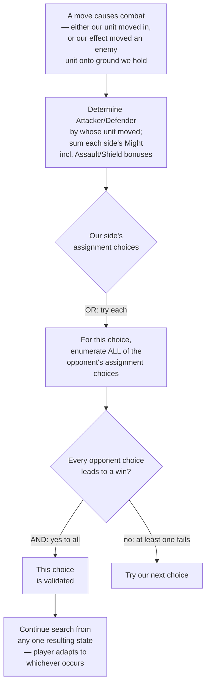

# Combat Resolution

Design for the piece flagged as deferred since `03-action-space.md`'s first draft. Needed for puzzle concepts 5 ("Clear the Way") and 6 ("Redirection"). Rules grounded directly in the official Core Rules PDF (same source as everything else — `https://cmsassets.rgpub.io/sanity/files/dsfx7636/news_live/e9ac8e3d33e0f78cef296f5945aba7bc1313b086.pdf`).

## Rules grounding

**Attacker/Defender designation** (rule ~464): *"The Attacker is the player whose unit(s) applied the Contested status to the Battlefield... The Defender is the player who did not apply the Contested status."* — i.e. whoever moved in is the Attacker, whoever already held the battlefield is the Defender.

**Correction — we are NOT always the Attacker.** The designation is about which unit *moved and caused the Contested status*, not about who took the action. Since the opponent is tapped out, we're the only one who ever *acts* — but our own effects can move an *enemy* unit (Charm: "Move an enemy unit"; Blitzcrank: "you may move an enemy unit to here"). If we use such an effect to move an enemy unit onto a battlefield **we** already control, that enemy unit is the one applying Contested status — so **the opponent becomes the Attacker and we become the Defender**, even though we're the one who took the action. Puzzle concept 6 ("Redirection") is exactly this case: Blitzcrank pulls the opponent's blocker onto a battlefield we hold, and the resulting combat has the opponent attacking, us defending.

The role that actually matters for the AND/OR split below isn't the Attacker/Defender label — it's **whose controller is doing the assigning**. Our own side's damage assignment (whether we're nominally Attacker or Defender) is always our choice (OR). The opponent's side's assignment (whether they're nominally Attacker or Defender) is always adversarial (AND). The Attacker/Defender label still matters for two other things: rule 465.2's "Starting with the Attacker" assignment order, and any keyword that reads off the designation directly (Assault: "+Might while I'm an attacker"; Shield: "+Might while I'm a defender"; Tank: "must be assigned combat damage first" — this one doesn't care which side, just applies within whichever side it's on). Might sums for the Combat Damage Step must include these bonuses, which means each unit's Attacker/Defender designation for the current combat needs to be known at Might-summing time, not just at the end.

**The Combat Damage Step** (rule ~465.2): *"Sum the Might of all Attacking Units. Sum the Might of all Defending Units. Starting with the Attacker, each player assigns an amount of damage equal to their summed Might among the other's Units."* Both sides assign damage — not just the attacker. Each side's full summed Might must be assigned (mandatory), distributed among the opposing side's units however the assigning player chooses, subject to:

**Might is ONE stat doing two jobs** (correction, 2026-09-12): it's both how much damage a unit deals and how much damage kills it (Lethal Damage is non-zero damage >= Might), so every bonus to it raises **both**. The original implementation applied Assault/Shield only to the damage-dealt side, leaving `_apply_damage` checking raw printed Might — so a 3-Might Assault attacker hit for 4 but still died to 3. Confirmed with the user and fixed: `combat.effective_might(unit, designation, effect_id)` is now the single source for both the damage pool and the lethal threshold.

The bonuses are **conditional on their own trigger**, though — a 3-Might Shield unit still dies to a 3-damage spell, because it isn't defending at that moment. So `designation` must be passed as `None` for any non-combat damage (`deal_damage_to_unit`), and only as `"attacker"`/`"defender"` inside an actual combat. A **battlefield's** flat Might bonus (Trifarian War Camp) is positional rather than conditional and therefore applies in *any* context while the unit stands there, including against direct effect damage — see `11-battlefield-effects.md`.

**Lethal-first rule**: *"Units must have lethal damage assigned to them in full before damage is assigned to a different Unit."* You can't spread damage thin across many units — you must fully commit lethal damage (Might minus damage already marked, minimum enough to kill) to one unit before starting on the next. Once every unit you've chosen to target already has lethal assigned, any further excess can go anywhere (pure overkill, no rules consequence). Critically, **the assigning player is not required to touch every opposing unit** — they can dump their entire pool into a subset and leave the rest at zero damage entirely.

## The asymmetry that matters

- **Our side's damage assignment** (whichever of Attacker/Defender we are this combat, assigning among the opponent's units): this is **our choice**. When our side has 2+ units, or the opponent's side has 2+ units to distribute across, this is a normal search branch point — an OR-node, exactly like every other choice in this solver. We only need one assignment to lead to a win.
- **The opponent's side's damage assignment** (whichever of Attacker/Defender they are, assigning among our units): this is **not our choice**, and — critically — not something a real puzzle-solving player can predict or control either. A puzzle's stated solution has to hold up no matter which of our units the opponent chooses to kill. This is the "sometimes it's better not to kill a unit" case: the opponent, choosing how to split damage among *our* units, might deliberately spare the unit that would help us if it survived and instead kill a different one that hurts us more — and our solution must still work regardless.

This is a **localized adversarial (AND) node** inside an otherwise single-player (OR) search — not a general minimax opponent (that stays explicitly out of scope, `07-scope-and-cut-list.md`). It only ever arises at the moment of the opponent's damage assignment, and only when the opponent's side actually has a real choice (2+ units at the contested battlefield). Both of the currently-sketched puzzles needing combat (5 and 6) have a **single-unit opponent side**, where there's no choice to make at all — the assignment is forced, so the AND-node collapses to a single branch trivially. Building the general mechanism correctly now means it's already right whenever a future puzzle does give the opponent a real choice (on either side of the Attacker/Defender line, including a Blitzcrank-style redirection like puzzle 6), without a special case that needs revisiting.

## Damage assignment enumeration

Given a damage pool `P` (summed Might) and a set of target units (each with `might` and `damage` already marked), enumerate the assigning player's valid choices:

- Pick an ordered sequence of *some or all* target units (order matters — it determines who gets lethal-committed first).
- Walk the sequence: each unit in turn receives `max(1, might - damage)` (its remaining lethal threshold), consumed from the pool, until the pool runs out. The unit where the pool runs out gets whatever's left (possibly less than lethal — a legal partial hit, per the rules' own example: 5 damage across four 3-Might units must fully lethal one, then partially hit a second with the remaining 2, not spread 3 ways).
- Units not reached in the sequence take 0.
- Once every targeted unit already has at least lethal assigned, remaining pool is free overkill — doesn't change which units die, so for solving purposes it's not a distinct outcome and doesn't need separate branches.

For v0's tiny unit counts (puzzle-scale, not real 40-card-deck-scale), this is cheap to enumerate exhaustively: it's essentially "which subset dies, in what order, with the shape of the last partial hit" — a handful of cases, not a combinatorial explosion.

## Solver change: AND-node for defender assignment



Source: [`diagrams/09-combat-and-or.mmd`](diagrams/09-combat-and-or.mmd)

`_dfs` needs a new case: when the current action triggers combat, it doesn't simply apply one deterministic child and recurse. Instead:

1. Determine Attacker/Defender by whose unit's move caused the Contested status (not by who took the action).
2. For each of *our* assignment choices `a` (on whichever side is ours):
   - For each of the *opponent's* assignment choices `d` given `a` (on whichever side is theirs):
     - Compute the resulting state (apply both assignments, remove dead units, resolve control per the existing rule 466.7.b logic).
     - Recurse: does `_dfs` from this resulting state, at `remaining - 1`, find a win?
   - If **every** `d` produced a win: choice `a` is validated — see the next section for exactly what gets returned (a strategy map, not a path).
   - If any `d` failed: try the next `a`.
3. If no `a` survives all its `d`s, this combat-triggering action fails at this depth (same as any other action with no winning continuation) — feeds into the existing transposition-table FAIL caching unchanged.

## `solve()`'s return type: a strategy, not a path

Decided: `solve()` returns a **strategy**, not a flat path, built now rather than deferred — needed correctly from the start rather than patched in later once a puzzle forces the issue.

A strategy turns out not to need a bespoke nested tree type. Our own choice at any given state is always just *one* recommended action — we never need to represent "the other options we didn't take." The opponent's branching is already fully captured by the *edge* itself (does resolving this action fan out to multiple possible resulting states, or exactly one). So the whole strategy collapses to:

```python
Strategy = dict[StateKey, Action]  # canonical_key(state) -> the one action to take from there
```

covering every state the player might actually find themselves in while following the strategy — including every state reachable via an opponent-forced branch, since the strategy has to hold up in all of them. A state absent from the map is either a `"win"` terminal (nothing left to recommend) or not part of the strategy at all.

Building it during search: `_dfs` still explores our own choices depth-first as before (OR). When it reaches a combat-triggering action:
- For each of our assignment choices `a`, enumerate the opponent's possible responses.
- For choice `a` to be viable, **every** opponent response must have a winning continuation within the remaining depth — recurse into each and require all of them to succeed (the AND-node from the diagram above).
- If they all succeed: merge their returned per-state maps together, add `canonical_key(current_state) -> a`, and that's the (possibly much larger, if the opponent had real choices) strategy for this subtree.
- If any response fails: try the next `a`.

This is the same shape `export.py`'s schema now expects (`06-export-schema.md`'s `solution` field is this exact map, just with `canonical_key` swapped for the string `state_hash`) — the solver and the exporter were designed to agree on this representation from the start, not bolted together after the fact.

## Implementation status (2026-09-12)

Implemented: `solver/engine/combat.py` (Might-summing with Assault/Shield, lethal-first assignment enumeration, `apply_combat`, `enumerate_combat_outcomes`), a new `ResolveCombat` action in `actions.py`, and the AND/OR extension in `search.py`'s `_dfs`/`_resolve_combat_search`. 74/74 tests passing, including two that directly prove the AND-node mechanism: one where the opponent can deny a win by choosing which of our two units to kill (correctly rejected), one where every opponent choice still wins (correctly accepted, strategy covers both branches).

**Two real bugs caught while implementing**, beyond the design itself:
1. `enumerate_combat_outcomes` initially conflated "the opponent's own units (whose Might sums to their pool)" with "the units their pool gets assigned to (ours)" — used the same variable for both, which are opposite sides. Silently produced a single all-zero "opponent does nothing" outcome instead of enumerating their real choices. Caught by the AND-node test actually exercising a real 2-unit opponent choice.
2. A Standard Move always exhausts its unit (rule 145.1) — this means a unit can **never** make two Standard Moves in the same turn, including a "relay" (Battlefield→Base→Battlefield) to route around not having Ganking. The first test scenario assumed a 2-hop relay was a legal fallback for a non-Ganking unit; it isn't. Fixed by using an outcome-collapsing setup instead (see the test itself) rather than relying on a relay that the rules don't actually permit.

**Update (2026-09-12): the "we are Defender" gap is closed.** `abilities.UNIT_PLAY_TRIGGERS` is a new, generic "when you play me" registry (`PlayUnit.trigger_params`) — Blitzcrank's "you may move an enemy unit to here" is its first entry. Its effect can return multiple outcomes (via `combat.enumerate_combat_outcomes`, the same function `ResolveCombat` uses), and `_dfs` handles it with the same `_and_or_search` AND-node, generalized out of what was originally `_resolve_combat_search`. This is deliberately a reusable mechanism, not a one-off for this card — built this way because many more "when played" effects are expected later. `combat.py`'s "we are Defender" logic, previously written generically but unreachable, is now exercised through real action generation (not a synthetic construction) and covered by tests proving a genuine multi-outcome opponent choice arises from it. **Puzzle 6 ("Redirection") can now be authored.** `PlaySpell`-triggered enemy-unit moves (e.g. Charm) still route through the older, narrower path and aren't wired to this yet — same registry pattern applies whenever a puzzle needs one.

## What this does NOT do

- No general adversarial opponent (turn-taking, spell-casting, blocking decisions) — still explicitly out of scope.
- No showdown/reaction modeling — the tapped-out assumption still removes all of that; this is purely the mandatory damage-assignment procedure within combat that already-present units must go through.
- No "when I attack" / "when I defend" triggered-ability ordering yet — that's `07-scope-and-cut-list.md`'s open item #7, deliberately separate from this doc. Combat resolution here is pure damage/Might arithmetic; adding triggered abilities into the mix is a follow-up once a puzzle actually needs one.
