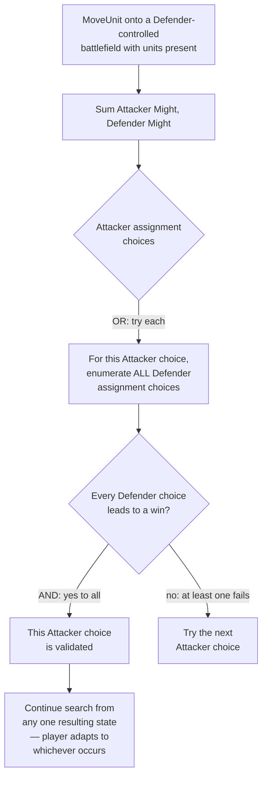

# Combat Resolution

Design for the piece flagged as deferred since `03-action-space.md`'s first draft. Needed for puzzle concepts 5 ("Clear the Way") and 6 ("Redirection"). Rules grounded directly in the official Core Rules PDF (same source as everything else — `https://cmsassets.rgpub.io/sanity/files/dsfx7636/news_live/e9ac8e3d33e0f78cef296f5945aba7bc1313b086.pdf`).

## Rules grounding

**Attacker/Defender designation** (rule ~464): *"The Attacker is the player whose unit(s) applied the Contested status to the Battlefield... The Defender is the player who did not apply the Contested status."* — i.e. whoever moved in is the Attacker, whoever already held the battlefield is the Defender.

**Scope simplification specific to this project:** since puzzles are single-turn and the opponent is tapped out (never takes actions), **the searched player (`state.turn_player`) is always the Attacker, and the opponent is always the Defender.** The opponent never initiates a move, so it can never be the Attacker. This matters a lot for what follows.

**The Combat Damage Step** (rule ~465.2): *"Sum the Might of all Attacking Units. Sum the Might of all Defending Units. Starting with the Attacker, each player assigns an amount of damage equal to their summed Might among the other's Units."* Both sides assign damage — not just the attacker. Each side's full summed Might must be assigned (mandatory), distributed among the opposing side's units however the assigning player chooses, subject to:

**Lethal-first rule**: *"Units must have lethal damage assigned to them in full before damage is assigned to a different Unit."* You can't spread damage thin across many units — you must fully commit lethal damage (Might minus damage already marked, minimum enough to kill) to one unit before starting on the next. Once every unit you've chosen to target already has lethal assigned, any further excess can go anywhere (pure overkill, no rules consequence). Critically, **the assigning player is not required to touch every opposing unit** — they can dump their entire pool into a subset and leave the rest at zero damage entirely.

## The asymmetry that matters

- **Our damage assignment** (Attacker, assigning among the Defender's units): this is **our choice**. When we have 2+ attacking units or the defender has 2+ units to distribute across, this is a normal search branch point — an OR-node, exactly like every other choice in this solver. We only need one assignment to lead to a win.
- **The opponent's damage assignment** (Defender, assigning among our attacking units): this is **not our choice**, and — critically — not something a real puzzle-solving player can predict or control either. A puzzle's stated solution has to hold up no matter which of our units the opponent chooses to kill. This is the "sometimes it's better not to kill a unit" case: the opponent, choosing how to split damage among *our* units, might deliberately spare the unit that would help us if it survived and instead kill a different one that hurts us more — and our solution must still work regardless.

This is a **localized adversarial (AND) node** inside an otherwise single-player (OR) search — not a general minimax opponent (that stays explicitly out of scope, `07-scope-and-cut-list.md`). It only ever arises at the moment of defender damage assignment, and only when the defender actually has a real choice (2+ units at the contested battlefield). Both of the currently-sketched puzzles needing combat (5 and 6) have a **single-unit defender**, where there's no choice to make at all — the assignment is forced, so the AND-node collapses to a single branch trivially. Building the general mechanism correctly now means it's already right whenever a future puzzle does give the defender a real choice, without a special case that needs revisiting.

## Damage assignment enumeration

Given a damage pool `P` (summed Might) and a set of target units (each with `might` and `damage` already marked), enumerate the assigning player's valid choices:

- Pick an ordered sequence of *some or all* target units (order matters — it determines who gets lethal-committed first).
- Walk the sequence: each unit in turn receives `max(1, might - damage)` (its remaining lethal threshold), consumed from the pool, until the pool runs out. The unit where the pool runs out gets whatever's left (possibly less than lethal — a legal partial hit, per the rules' own example: 5 damage across four 3-Might units must fully lethal one, then partially hit a second with the remaining 2, not spread 3 ways).
- Units not reached in the sequence take 0.
- Once every targeted unit already has at least lethal assigned, remaining pool is free overkill — doesn't change which units die, so for solving purposes it's not a distinct outcome and doesn't need separate branches.

For v0's tiny unit counts (puzzle-scale, not real 40-card-deck-scale), this is cheap to enumerate exhaustively: it's essentially "which subset dies, in what order, with the shape of the last partial hit" — a handful of cases, not a combinatorial explosion.

## Solver change: AND-node for defender assignment

Source: [`diagrams/09-combat-and-or.mmd`](diagrams/09-combat-and-or.mmd)

`_dfs` needs a new case: when the current action is a combat-triggering `MoveUnit`, it doesn't simply apply one deterministic child and recurse. Instead:

1. For each Attacker (our) assignment choice `a`:
   - For each Defender (opponent) assignment choice `d` given `a`:
     - Compute the resulting state (apply both assignments, remove dead units, resolve control per the existing rule 466.7.b logic).
     - Recurse: does `_dfs` from this resulting state, at `remaining - 1`, find a win?
   - If **every** `d` produced a win: choice `a` is validated. Return a path built from `a` and (for path-reporting purposes) one representative `d`'s continuation.
   - If any `d` failed: try the next `a`.
2. If no `a` survives all its `d`s, this combat-triggering action fails at this depth (same as any other action with no winning continuation) — feeds into the existing transposition-table FAIL caching unchanged.

## Structural implication: `solve()`'s return type

`solve()` currently returns a flat `list[Action]`. That's still correct and sufficient **whenever a puzzle's combat never gives the defender a real choice** (single-unit defenders, like puzzles 5 and 6 as currently sketched) — the AND-node collapses to exactly one branch, so the flat list stays accurate as "the" continuation.

**Proposed for now:** keep `solve()`'s flat-list return type, since no currently-sketched puzzle needs anything richer, and note explicitly that it's only guaranteed accurate for puzzles where the defender's damage assignment is forced (0 or 1 meaningful units at the contested battlefield). If a future puzzle wants a genuinely branching defender choice, `solve()`'s return type needs to grow into something that can represent a strategy (a subtree of the DAG, not a flat list) rather than a single path — `export.py`'s DAG output already handles this fine (it's building the full graph regardless), so the gap is specifically in `solve()`'s convenience return value, not in the exported puzzle data. Flagging this now rather than discovering it mid-implementation of a puzzle that needs it.

## What this does NOT do

- No general adversarial opponent (turn-taking, spell-casting, blocking decisions) — still explicitly out of scope.
- No showdown/reaction modeling — the tapped-out assumption still removes all of that; this is purely the mandatory damage-assignment procedure within combat that already-present units must go through.
- No "when I attack" / "when I defend" triggered-ability ordering yet — that's `07-scope-and-cut-list.md`'s open item #7, deliberately separate from this doc. Combat resolution here is pure damage/Might arithmetic; adding triggered abilities into the mix is a follow-up once a puzzle actually needs one.
